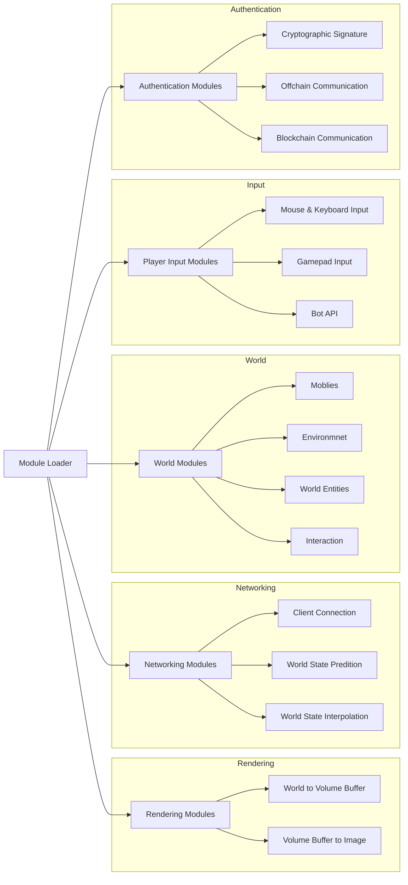

Игровой клиент Age of Guilds придерживается модульной архитектуры и разрабатывается на игровом движке Unity. 

# Исходный код и репозитории

Основной репозиторий клиента aofg-client, содержит Unity-проект с UPM зависимостями. 

1) Выполните в терминале/командной строке: `git clone https://github.com/aofg/aofg-client.git`
2) Откройте склонированный проект в Unity 2018.3 или моложе
3) Дождитесь установки зависимостей (может занять некоторое время)
4) Запустите проект

# Entity Component Systems

# Модульная архитектура

# Архитектура проекта

## Модули Age of Guilds

Весь программный код клиента упакован в отдельные модули и взаимодействует через обмен

## Системные требования

| | Минимальные | Рекомендуемые |
|:-|:-|:-|
| **Операционная система** | MacOS X 10.14 или Windows 10 | |
| **Центральный процессор** | 4 ядра на 2.4 GHz | 8 ядер на 3 GHz |
| **Оперативная память** | 8 GB | 16 GB |
| **Видео-карта** | GTX 1050 4 GB | GTX 1070 TI 8GB |
| **Хранилище** | 7200 RPM HDD | SSD |

* Rendering
* Networking
* User Interfaces
* Modding